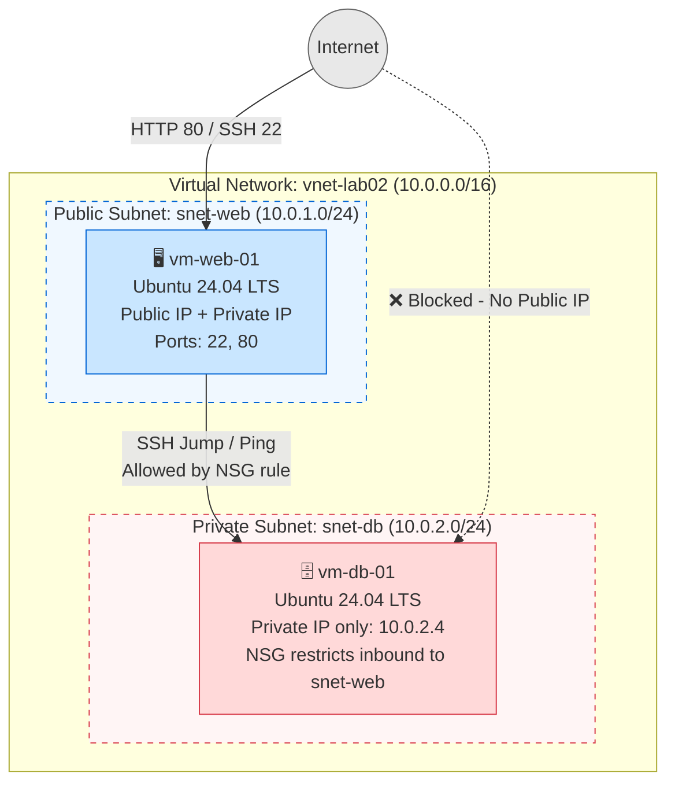

# Lab 02: Building a Secure 2-Tier Web Application on Azure

**Platform:** Microsoft Azure

---

## 📌 Overview

This lab demonstrates a classic **Infrastructure-as-a-Service (IaaS)** two-tier architecture on Azure. It walks through provisioning a Virtual Network with segmented public and private subnets, deploying a web server and a database server into those subnets, and locking down the database tier with Network Security Groups (NSGs) so it's only reachable from the web tier — never directly from the internet.

**Key concepts practiced:**
- Virtual Network (VNet) and subnet segmentation
- Public vs. private IP addressing
- Network Security Groups (NSGs) for micro-segmentation
- SSH "jump host" / bastion-style connectivity
- Principle of least privilege for network access

---

## 🏗️ Architecture Diagram



**Traffic flow summary:**
| Path | Allowed? | Why |
|---|---|---|
| Internet → `vm-web-01` (HTTP/SSH) | ✅ Yes | Web tier is public-facing by design |
| Internet → `vm-db-01` (any port) | ❌ No | No public IP assigned; NSG also scopes inbound to the web subnet only |
| `vm-web-01` → `vm-db-01` | ✅ Yes | Explicit NSG rule allows `10.0.1.0/24` → DB subnet |
| Home computer → `vm-db-01` directly | ❌ No | Must jump through `vm-web-01` first |

---

## ✅ Prerequisites

- [ ] Active Azure Subscription
- [ ] Basic familiarity with Azure Portal navigation
- [ ] Terminal / SSH client installed locally (Terminal, PowerShell, or WSL)

---

## 🏷️ Naming Conventions & Variables

| Resource | Name | Notes |
|---|---|---|
| Resource Group | `rg-lab02-[yourname]` | Replace `[yourname]` throughout |
| Virtual Network | `vnet-lab02` | Address space `10.0.0.0/16` |
| Public Subnet | `snet-web` | `10.0.1.0/24` |
| Private Subnet | `snet-db` | `10.0.2.0/24` |
| Web VM | `vm-web-01` | Public + Private IP |
| Database VM | `vm-db-01` | Private IP only (`10.0.2.4`) |
| SSH Key Pair | `key-lab02` | Shared across both VMs |

---

## 🚀 Step-by-Step Instructions

### Phase 1 — Network Foundation

1. In the Azure Portal, search **Virtual Networks** → **Create**.
2. **Basics:**
   - Resource Group: *Create new* → `rg-lab02-[yourname]`
   - Name: `vnet-lab02`
   - Region: `Central US`
3. **IP Addresses:**
   - Address space: `10.0.0.0/16`
   - Subnet 1: `snet-web` → `10.0.1.0/24`
   - Subnet 2: `snet-db` → `10.0.2.0/24`
4. **Review + create** → **Create**.

### Phase 2 — Deploy the Web Server (Front End)

1. Search **Virtual Machines** → **Create**.
2. **Basics:**
   - Resource Group: `rg-lab02-[yourname]`
   - Name: `vm-web-01`
   - Region: `Central US`
   - Image: `Ubuntu Server 24.04 LTS`
   - Size: `Standard_D2alds_v6`
   - Key pair name: `key-lab02`
   - Public inbound ports: `HTTP (80)` and `SSH (22)`
3. **Networking:**
   - Subnet: `snet-web`
   - Public IP: *Create new (Standard)*
4. **Review + create** → **Create**.
5. Download the private key (`.pem`) if prompted — keep it safe.

### Phase 3 — Deploy the Database Server (Back End)

1. Create another Virtual Machine.
2. **Basics:**
   - Resource Group: `rg-lab02-[yourname]`
   - Name: `vm-db-01`
   - Region: `Central US`
   - Image: `Ubuntu Server 24.04 LTS`
   - Size: `Standard_D2alds_v6`
   - Key pair: *Use existing key stored in Azure* → `key-lab02`
   - Public inbound ports: `SSH (22)` only
3. **Networking (critical step):**
   - Virtual Network: `vnet-lab02`
   - Subnet: **`snet-db`** ⚠️ (do not leave on the default subnet)
   - Public IP: **None** — this VM should never be reachable directly from the internet
4. **Review + create** → **Create**.

### Phase 4 — Validate Connectivity (The "Jump")

Since `vm-db-01` has no public IP, you connect to `vm-web-01` first, then "jump" internally to the DB server.

1. Get the private IP of `vm-db-01` (should be `10.0.2.4`).
2. SSH into the web server from PowerShell:
   ```powershell
   ssh -i key-lab02.pem azureuser@<public-ip-of-web>
   ```
3. From inside `vm-web-01`, test connectivity to the DB server:
   ```bash
   ping 10.0.2.4
   ```
4. You should see successful replies, confirming both VMs share the VNet. Press `Ctrl + C` to stop.

### Phase 5 — Lock Down the Firewall (NSG)

By default the DB VM's NSG may be permissive on the VNet level. Tighten it so **only** the web subnet can reach it.

1. Go to `vm-db-01` → **Networking** tab.
2. Open its Network Security Group (e.g., `vm-db-01-nsg`).
3. **Inbound security rules** → **+ Add**.
4. Configure the rule:
   | Field | Value |
   |---|---|
   | Source | IP Addresses |
   | Source IP / CIDR | `10.0.1.0/24` |
   | Source port ranges | `*` |
   | Destination | Any |
   | Service | Custom |
   | Destination port ranges | `*` (or `3306`/`5432` if a real DB engine is installed) |
   | Action | Allow |
   | Priority | `100` |
   | Name | `Allow-Web-Subnet` |
5. Click **Add**.

> **Note:** Because `vm-db-01` has no public IP, internet traffic was already blocked. This rule explicitly documents and enforces that only the web subnet is permitted — good practice for defense-in-depth.

---

## 🛠️ Troubleshooting

| Issue | Cause / Fix |
|---|---|
| Ping fails between VMs | Confirm `vm-db-01` was deployed into `snet-db` and both VMs are in `vnet-lab02`. |
| Can't SSH into `vm-db-01` directly | Expected — it has no public IP. SSH into `vm-web-01` first, then jump to the DB server. (Copying your `.pem` key to the web server to jump directly is an advanced follow-up.) |

---

## 🧹 Clean Up

To avoid ongoing charges, delete the entire resource group when finished:

```bash
az group delete --name rg-lab02-[yourname] --yes --no-wait
```

Or via the Portal: **Resource Groups** → `rg-lab02-[yourname]` → **Delete resource group**.

---

## 🎯 Key Takeaways

- Network segmentation (public vs. private subnets) is a foundational pattern for securing multi-tier applications.
- Removing a public IP is the first line of defense — NSGs provide a second, explicit layer of control.
- Bastion/jump-host patterns let administrators reach private resources without exposing them directly to the internet.
